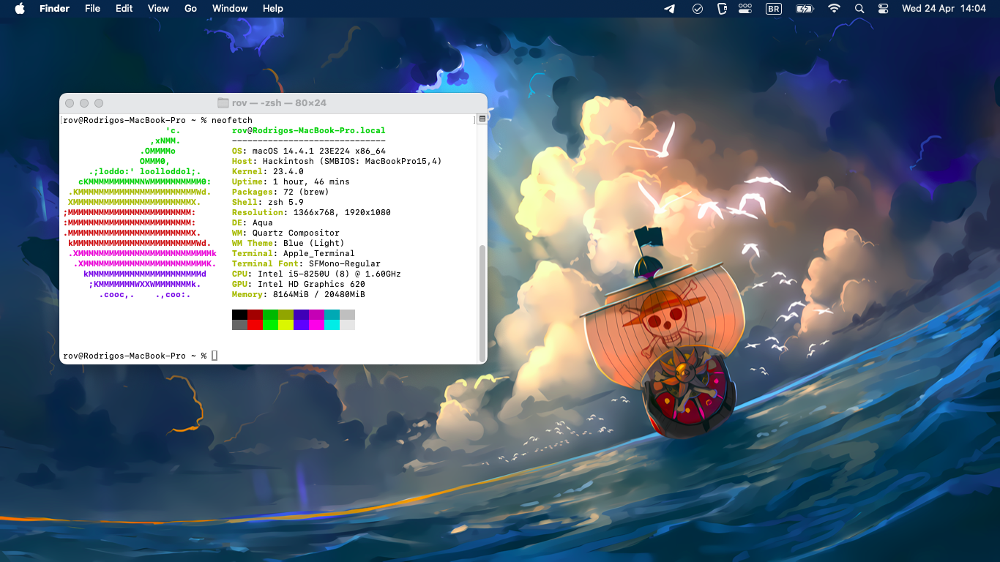

# Ideapad 330 - macOS - OpenCore

## Introduction

:exclamation:The EFI folder available in this repository was made for my own personal use. I **cannot** guarantee that it will work with your hardware, even it is the same laptop. Use it as a *reference* for building your OpenCore config.

:arrow_right: Follow [Dortania's Guides](https://dortania.github.io/getting-started/) (*they're awesome*) and build your own EFI setup. It's a really easy to follow guide - just make sure to read everything twice and do things on your own time.

## :computer: My Hardware

| Type               | Description                                         |
| ------------------ | --------------------------------------------------- |
| **CPU**            | 1.8 GHz Intel Core i5-8250 (Kaby Lake-R)            |
| **GPU**            | Intel UHD 620                                       |
| **RAM**            | 20 GB (4 GB built-in - non-removable) DDR4 2133 MHz |
| **WiFi/Bluetooth** | Intel Dual Band Wireless-AC 3165                    |
| **Ethernet**       | Realtek RTL8111                                     |
| **Audio**          | Realtek ALC230                                      |
| **Keyboard**       | PS2 Keyboard                                        |
| **Trackpad**       | Alps I2C trackpad                                   |

## :white_check_mark: What works and what doesn't?

- [x] Graphics acceleration.
- [x] HDMI video/audio output.
- [x] WiFi and Bluetooth.
- [x] Ethernet.
- [x] Audio (speakers and headphone jack) and microphone.
- [x] Webcam.
- [x] USB ports.
- [x] Battery status.
- [x] Keyboard and trackpad, with gestures.
- [x] Power management.
- [x] iCloud and App Store.
- [x] iMessage and FaceTime.
- [ ] AirDrop.

:heavy_exclamation_mark: *AirDrop* doesn't work because the Intel card is not native supported on macOS.

### :pen: How to use

You need to fill in the SMBIOS information in the **config.plist** file with your own. Follow the Dorthania's guide - it should be pretty easy.